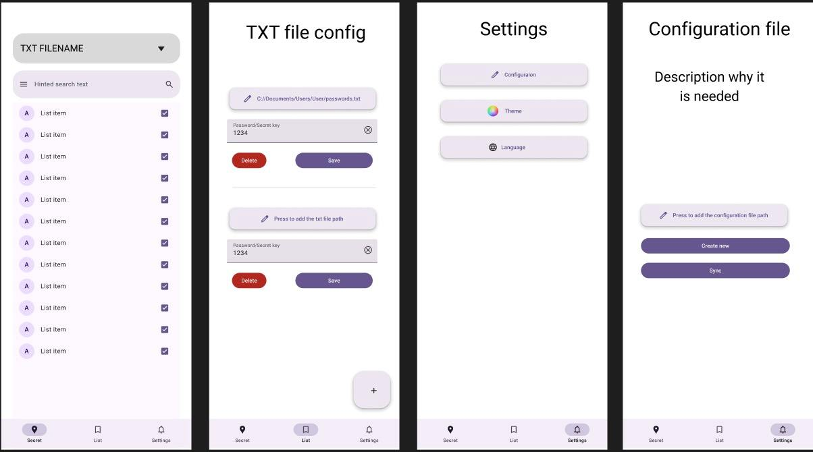
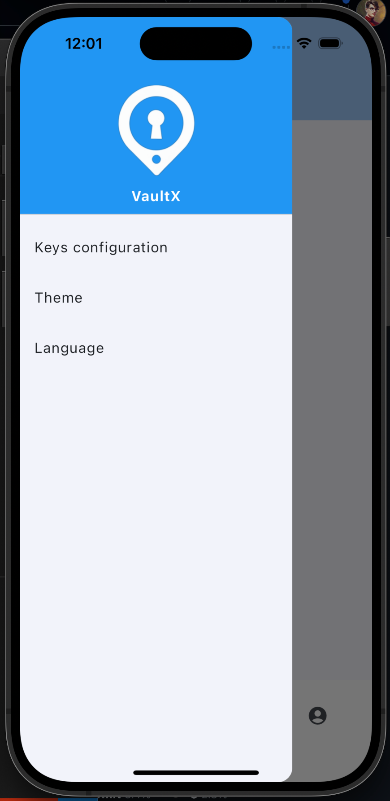

# VaultX - secure password manager

An application that allows users to store their passwords securely. The app uses AES encryption to encrypt your passwords. It also uses biometric authentication to ensure that only the user can access their passwords. The app will be available on Android, iOS and desktop.

## How it works

The main concept is allowing user to decide where they want to keep encrypted files and keys. They can be stored locally or in remote cloud storage e.g. Google drive. The synchronization feature will require creating a personal account. In this case all the necessary user data will be stored in a remote DB (login data, cloud storage access and refresh tokens)

Encrypted data will be stored in .txt files. Config JSON files will store the encryption key and .txt file path. All these files can be stored wherever user decides (locally on device, external storage device)

## Flow diagram:

## Database scheme:

## App screens

## Lesson changes

